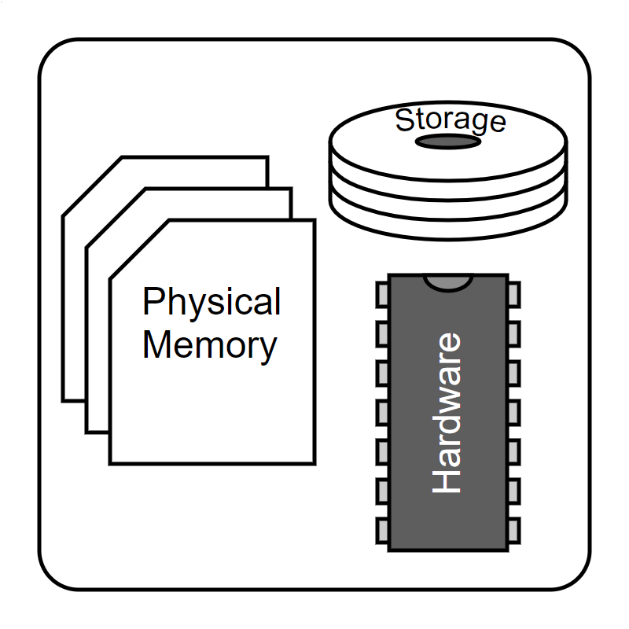
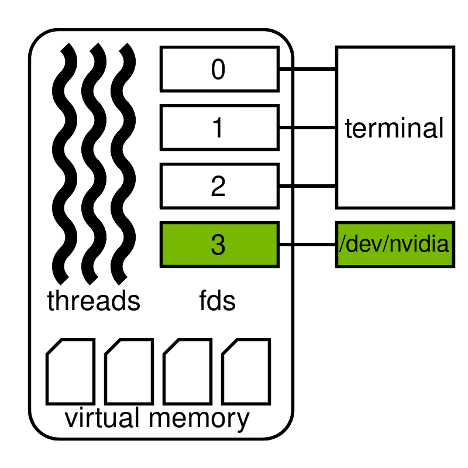
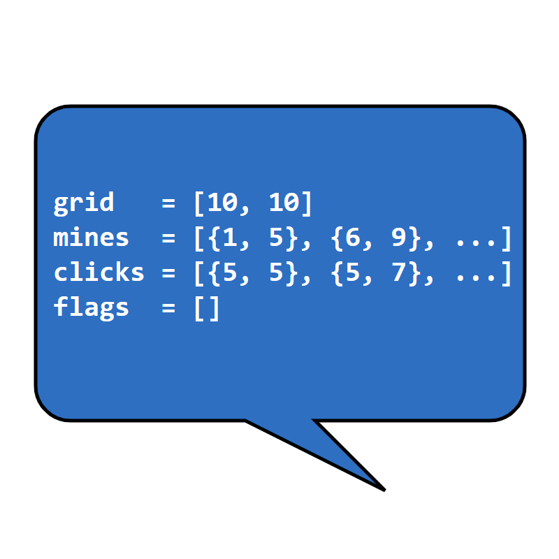
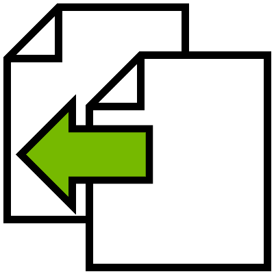
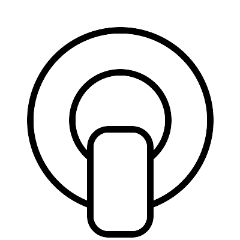
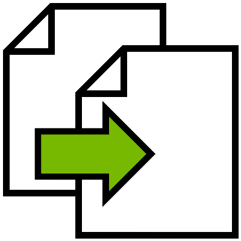

# The cuda-checkpoint Utility

Checkpoint and restore functionality for CUDA is exposed through a command-line utiity called `cuda-checkpoint`
which is available in the [bin](bin) directory of this repo.
This utility can be used to transparently checkpoint and restore CUDA state within a running Linux process,
and can be combined with [CRIU](https://criu.org/Main_Page) (described below) to fully checkpoint CUDA applications.

## 570 Features
Display driver version 570 includes these features not present in 550:
* NVML support
* integration with CRIU 4.0 or higher, providing process tree support
* [CUDA Driver interfaces](https://docs.nvidia.com/cuda/cuda-driver-api/group__CUDA__CHECKPOINT.html) at feature parity with the `cuda-checkpoint` utility
* a separate lock command which can take a timeout to avoid deadlocks

This [demo program](src/r570-features.c) shows many of these features in action!

## Background
Transparent, per-process checkpointing offers a middle ground between virtual machine checkpointing and application-driven checkpointing.
Per-process checkpointing can be used in combination with containers to checkpoint the state of a complex application,
facilitating uses-cases such as:

* fault tolerance (with periodic checkpoints)
* preemption of lower-priority work on a single node (by checkpointing the preempted task), and
* cluster scheduling (with migration)

Virtual Machine|Per-Process|Application Driven
---|---|---
||

The most popular utility for transparent per-process checkpointing is a utility called [CRIU](https://criu.org/Main_Page).

## CRIU
[CRIU](https://criu.org/Main_Page) (Checkpoint/Restore in Userspace) is an open source checkpointing utility
(maintained outside of NVIDIA) for Linux which can checkpoint and restore process trees.
CRIU exposes its functionality through a command line program called `criu`
and operates by checkpointing and restoring every kernel mode resource associated with a process. These resources include:

* anonymous memory,
* threads,
* regular files,
* sockets, and
* pipes between checkpointed processes.

Since the behavior of these resources is specified by Linux, and are independent of the underlying hardware,
CRIU knows how to checkpoint and restore them.
In contrast, NVIDIA GPUs provide functionality beyond that of a standard Linux kernel, and thus CRIU is not able to manage them.
`cuda-checkpoint` adds this capability, and can therefore be used with CRIU to checkpoint and restore a CUDA application.


## The Utility
`cuda-checkpoint` checkpoints and restores the CUDA state of a single Linux process.
The `cuda-checkpoint` utility supports display driver version 550 and higher and is located in the [bin](bin) directory of this repo.

```bash
localhost$ cuda-checkpoint --help
CUDA checkpoint and restore utility.
Version 570.86.10. Copyright (C) 2025 NVIDIA Corporation. All rights reserved.

Operations:
--get-state --pid <pid>
        Prints the current checkpoint state of the process specified by <pid>

--action lock | checkpoint | restore | unlock --pid <pid> [--timeout <ms>]
        Performs the specified action on <pid>.
        For the lock action a timeout can be provided, the lock operation will wait up to <ms> milliseconds for the operation to succeed.

--toggle --pid <pid>
        Toggles the CUDA state in the specified process between the running and checkpointed states

--get-restore-tid --pid <pid>
        Retrieves the CUDA restore thread ID of the process specified by <pid>

Options:
--pid|-p <pid>
        The pid upon which to perform the operation

--timeout|-t <timeout>
        Optional timeout that can be specified for the lock action in milliseconds

--help|-h
        Print this help message
```

The `cuda-checkpoint` binary can toggle the CUDA state of a process (specified by PID) between suspended and running.
A running-to-suspended transition is called a suspend and the opposite transition is called a resume.

A process's CUDA state is initially running.
When `cuda-checkpoint` is used to suspend CUDA in a process:

1.   any CUDA driver APIs which launch work, manage resources, or otherwise impact GPU state are locked;
2.  already-submitted CUDA work, including stream callbacks, are completed;
3.  device memory is copied to the host, into allocations managed by the CUDA driver; and
4.   all of CUDA’s GPU resources are released.

``cuda-checkpoint`` does not suspend CPU threads, which may continue to safely interact with CUDA by:
calling runtime or driver APIs (which may block until CUDA is resumed), and
accessing host memory (allocated by cudaMallocHost and similar APIs) which remains valid.

A suspended CUDA process no longer directly refers to any GPU hardware at the OS level
and may therefore be checkpointed by a CPU checkpointing utility such as CRIU.

When a process’s CUDA state is resumed using ``cuda-checkpoint``:

1.  GPUs are re-acquired by the process;
2.  device memory is copied back to the GPU, and GPU memory mappings are restored at their original addresses;
3.  CUDA objects such as streams and contexts are restored; and
4.  CUDA driver APIs are unlocked.

At this point, CUDA calls will unblock and CUDA may begin running on the GPU again.

## Example
This example will use `cuda-checkpoint` and `criu` to checkpoint a CUDA application called *counter*.
Every time *counter* receives a packet, it increments GPU memory and replies with the updated value.
The [source code](src/counter.cu) for *counter* is shown below.

```cuda
#include <stdio.h>
#include <sys/types.h>
#include <sys/socket.h>
#include <netinet/in.h>
#include <arpa/inet.h>

#define PORT 10000

__device__ int counter = 100;
__global__ void increment()
{
    counter++;
}

int main(void)
{
    cudaFree(0);

    int sock = socket(PF_INET, SOCK_DGRAM, IPPROTO_UDP);
    sockaddr_in addr = {AF_INET, htons(PORT), inet_addr("127.0.0.1")};
    bind(sock, (sockaddr *)&addr, sizeof addr);

    while (true) {
        char buffer[16] = {0};
        sockaddr_in peer = {0};
        socklen_t inetSize = sizeof peer;
        int hCounter = 0;

        recvfrom(sock, buffer, sizeof buffer, 0, (sockaddr *)&peer, &inetSize);

        increment<<<1,1>>>();
        cudaMemcpyFromSymbol(&hCounter, counter, sizeof counter);

        size_t bytes = sprintf(buffer, "%d\n", hCounter);
        sendto(sock, buffer, bytes, 0, (sockaddr *)&peer, inetSize);
    }
    return 0;
}
```

The *counter* application can be built using `nvcc`.

```bash
localhost$ nvcc counter.cu -o counter
```

Next, launch *counter* and wait to be sure that it is listening on its socket
(which is important if this demo is being launched as [a single script](src/example.sh)).

```bash
localhost# ./counter &
[1] 298027
localhost# sleep 1
```

Save *counter*’s PID for reference in subsequent commands.

```bash
localhost# PID=$!
```

Send *counter* a packet and observe the returned value.
The initial value was 100 but the response is 101, showing that the GPU memory has changed since initialization.

```bash
localhost# echo hello | nc -u localhost 10000 -W 1
101
```

Use `nvidia-smi` to confirm that *counter* is running on a GPU.

```bash
localhost# nvidia-smi --query --display=PIDS | grep $PID
        Process ID                        : 298027
```

Use `cuda-checkpoint` to suspend *counter*’s CUDA state.

```bash
localhost# cuda-checkpoint --toggle --pid $PID
```

Use `nvidia-smi` to confirm that *counter* is no longer running on a GPU

```bash
localhost# nvidia-smi --query --display=PIDS | grep $PID
```

Create a directory to hold the checkpoint image

```bash
localhost# mkdir -p demo
```

Use `criu` to checkpoint *counter*

```bash
localhost# criu dump --shell-job --images-dir demo --tree $PID
[1]+  Killed                  ./counter
```

Confirm that *counter* is no longer running

```bash
localhost# ps --pid $PID
    PID TTY          TIME CMD
```

Use `criu` to restore *counter*

```bash
localhost# criu restore --shell-job --restore-detached --images-dir demo
```

Use `cuda-checkpoint` to resume *counter*’s CUDA state

```bash
localhost# cuda-checkpoint --toggle --pid $PID
```

Now that *counter* is fully restored, send it another packet.
The response is 102, showing that earlier GPU operations were persisted correctly!

```bash
localhost# echo hello | nc -u localhost 10000 -W 1
102
```

## Functionality
As of display driver version 570, checkpoint and restore functionality is still being actively developed.
In particular, `cuda-checkpoint`:

* is x64 only,
* does not support UVM or IPC memory,
* does not support GPU migration,
* waits for already-submitted CUDA work to finish before completing a checkpoint,
* does not attempt to keep the process in a good state if an error (such as the presence of a UVM allocation) is encountered during checkpoint or restore.

These limitations will be addressed in subsequent display driver releases,
and will not require an update to the `cuda-checkpoint` utility itself.
The `cuda-checkpoint` utility simply exposes functionality that is contained in the driver.

## License
By downloading or using the software, you agree to the terms of the [License Agreement for NVIDIA Software Development Kits — EULA](https://docs.nvidia.com/cuda/eula/index.html).
